<!-- The SVGs in assets/ are generated: edit scripts/build_svgs.py and run `python scripts/build_svgs.py`. -->

  

 

  

 

  
  

 

<!-- Built daily by .github/workflows/snake.yml into the `output` branch. -->

  <picture>
    <source media="(prefers-color-scheme: dark)" srcset="https://raw.githubusercontent.com/RafaBits/RafaBits/output/snake-dark.svg" />
    <source media="(prefers-color-scheme: light)" srcset="https://raw.githubusercontent.com/RafaBits/RafaBits/output/snake-light.svg" />
    
  </picture>

 

  
    
  

